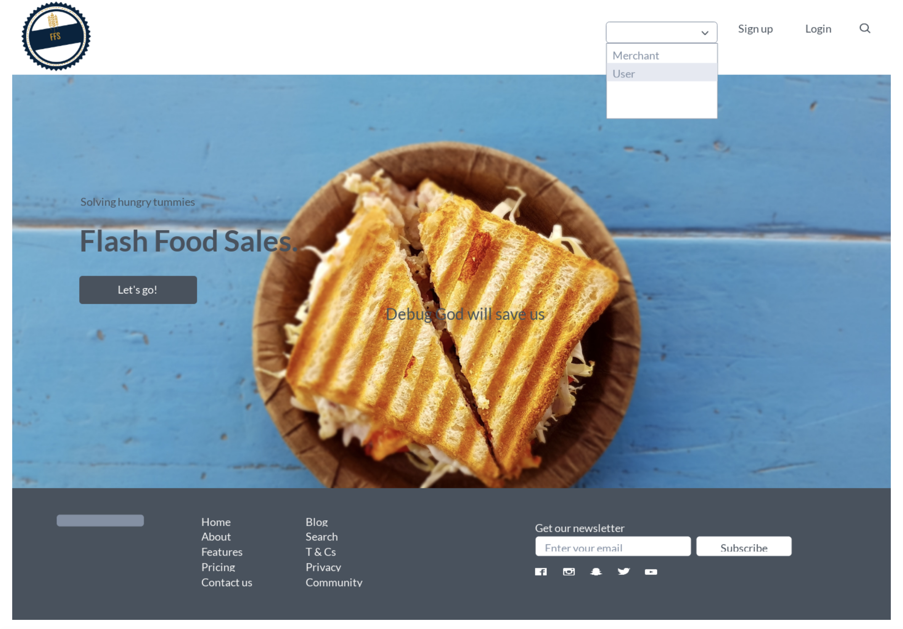
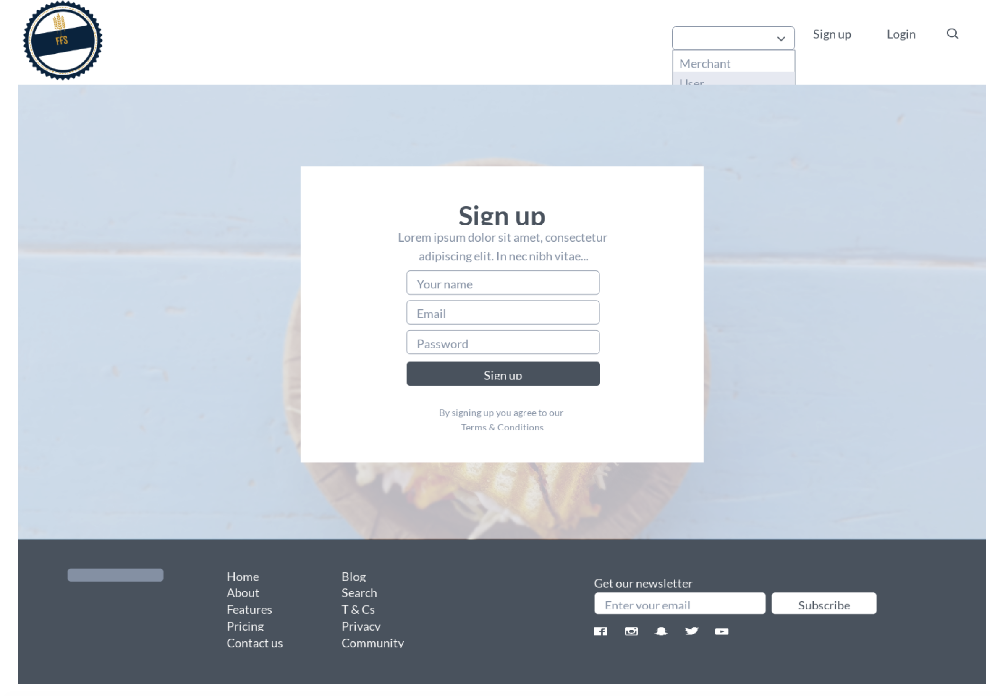
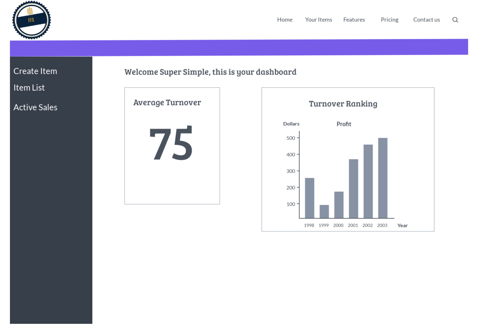
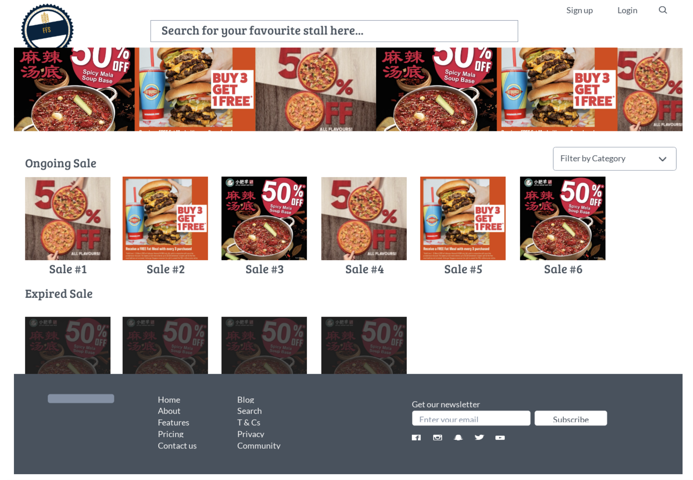
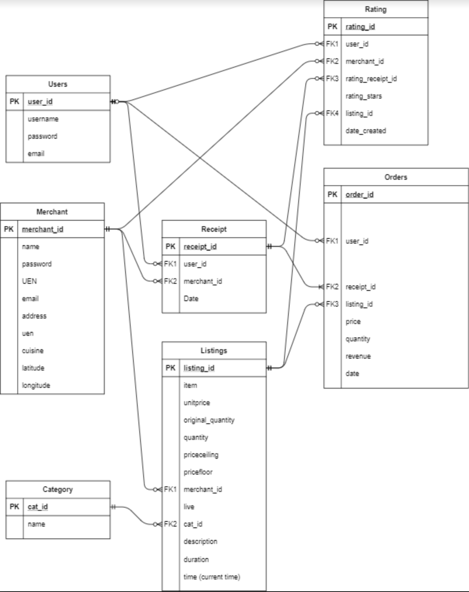

# SEI-24-Project-3

## About ##

Hosted [here](https://flash-food-sale.herokuapp.com/) on heroku. Register a new account to access the project.

## Motivation ##

 **As Merchants**

Who have consistent food wastage when they close their shops and are looking for a platform to let go of these products. We offer greater levels of customization and control over traditional e commerce sites as our main goal is to help you as merchants reduce your environmental footprint.

**As Consumers**
 
Who are looking for deals towards closing time, food flash sales provide them with an avenue to browse, buy and collect their deals all on the same day. Our IP based tracking system seeks to provide consumers with a good gauge of the distance from their point of interest. Integrated with Singapore’s very own OneMAP api, we are able to map out these distances to a reasonable degree, allowing them to grab their deals in a fuss free manner.

## Why Food Flash Sale ##

Food wastage is one of the biggest waste streams in Singapore.  Over the last decade, Singapore has seen its waste stream increase by over 20%. A main factor contributing to this is from restaurants over preparing and tossing food on a day to day basis. However, this doesn’t stem from a fact of a lack of demand, but rather that of a lack of information and means to purchase. Through Food Flash Sales, we seek to reduce this food wastage by matching restaurants to consumers through a Flash Sale that gives restaurants much greater control in hopes to reach out to their customers. Likewise, we are also providing consumers with a platform to seek out the best deals out there.

## Planning Phase ##

**Wire Frames**

## ERD ##

